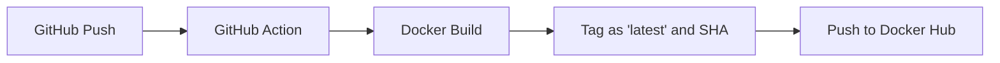

# 📝 Flask To-Do List App

A clean and simple to-do list web application built with Flask.  
Supports task creation, editing, completion tracking, priority levels, dark mode, and file-based persistence.

---

## 🚀 Features

- ✅ Add, delete, and edit tasks
- ✅ Mark tasks as completed with checkboxes
- ✅ Persistent task storage via `tasks.json`

---

## 📂 Project Structure
```
/
├── app.py                 # Main Flask app
├── Dockerfile             # Dockerfile
├── tasks.json             # JSON file for task storage
├── test_app.py            # Pytest-based unit tests
├── requirements.txt       # Python package requirements
├── README.md              # Project overview and instructions
├── static/
│   └── style.css          # Custom styling (light/dark modes, priorities)
└── templates/
    ├── base.html          # Layout template with header/footer and dark mode toggle
    └── index.html         # Main task list page
```

## Getting started
Clone this repo
```
git clone https://github.com/your-username/Todo-list-flask.git
cd Todo-list-flask
```

## 🐳 Docker Usage
(Issue #6)
### Build Image (Local)

```bash
docker build -t 2025cloud .
```

### Run Container
```bash
docker run -p 5000:5000 2025cloud
```

Then open your browser to:
http://127.0.0.1:5000


## ⚙️ GitHub Actions (CI/CD)
This project uses GitHub Actions to:
- Automatically build the Docker image on every push or pull request
- Tag the image as latest and <commit SHA>
- Push the image to Docker Hub at [rickylhy/2025cloud](https://hub.docker.com/r/rickylhy/2025cloud)

## 📦 Docker build flow


## (Optional) Manually tag and push to Docker Hub
```bash
docker tag 2025cloud rickylhy/2025cloud:latest
docker push rickylhy/2025cloud:latest
```

## 🏷️ Docker Tag Strategy
- latest: always points to the most recent successful build
- <commit SHA>: allows traceability for each deployment
